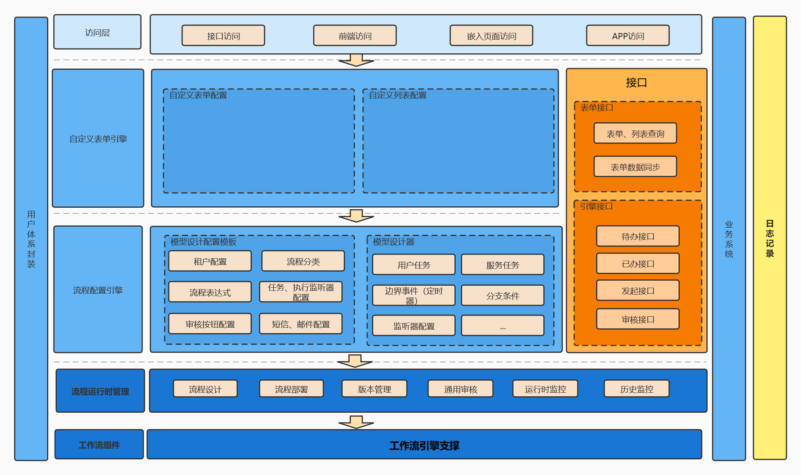
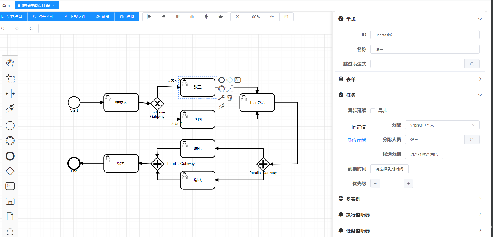
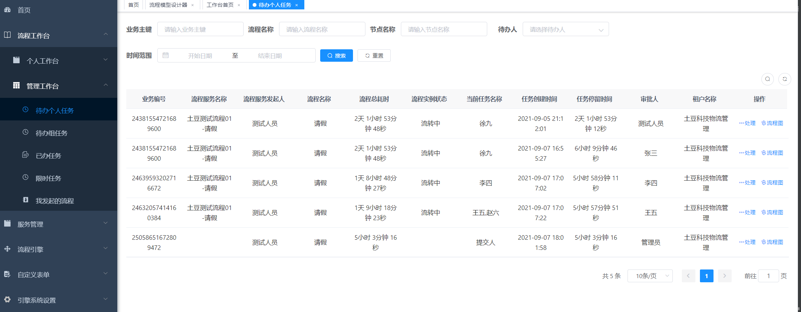
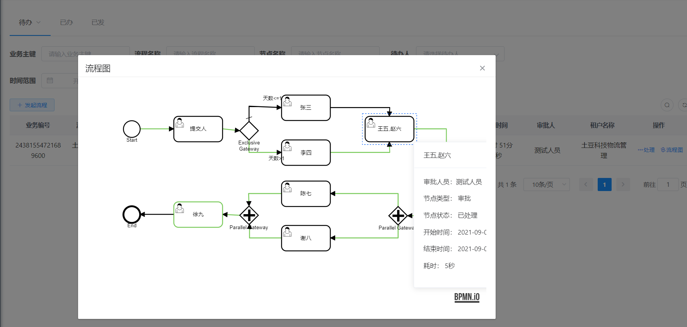

# process-cloud
基于flowable二次开发，微服务化流程引擎管理功能，提供流程模型编辑到部署监控一站式解决方案，扩展了众多官方API，提供项目微服务化集成方案。
## 引擎简介

如果你是新手，那么这绝对是你拿来学习flowable流程引擎最佳的项目；如果你对流程引擎熟悉，并且着手用流程引擎来辅助项目，那么这绝对是你最好的流程引擎微服务管理端。

* 本项目用户体系测试环境依赖若依，开发者可以切换集成自己公司的。
* 本项目技术采用Spring Boot、Spring Cloud & Alibaba。
* 注册中心、配置中心选型Nacos。
* 流量控制框架选型Sentinel，分布式事务选型Seata。
* RPC实现有Dubbo版本和OpenFeign版本。
* 文件存储Minio

## 系统模块

~~~
process-cloud     
├── process-bussiness              // 流程引擎对接示例 [8200]
├── process-bussiness-front         // 流程引擎对接示例前端 [80]
├── process-center            // 流程引擎核心 [8100]
├── process-cloud-front            // 流程引擎核心前端  [80]
├── process-center-api             // 对外提供服务接口模块
├── process-form-center         // 自定义表单核心 [8000]
├── process-common          // 通用模块
│       └── process-common-pojo                         // 核心模块
│       └── process-idm-pojo                    // 
│       └── process-center-pojo                    // 
├── process-idm-api         // 用户体系对接依赖
├── process-gateway          // 流程引擎网关  [8080]
├── process-auth          // 流程引擎认证中心  [9200]
├── process-system          // 流程引擎用户体系  [9201]
├──pom.xml                // 公共依赖
~~~

## 架构图

## 特色功能

## 在线体验
- cs/tdkj123456
- 新的更新第一时间会在体验服务上出现

演示地址：http://47.96.74.120  
## 演示图

## 流程引擎交流群&公众号
